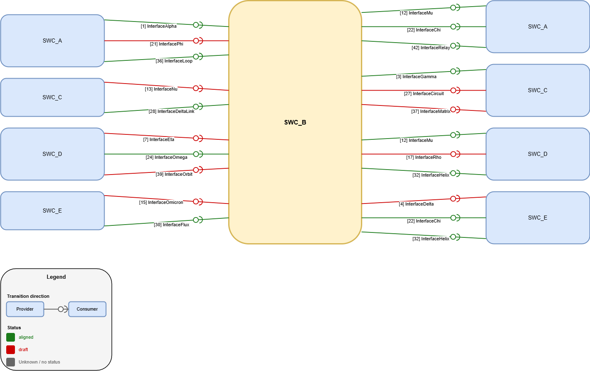

# Interface Diagram Generator

Generate Draw.io `.drawio` diagrams from a semicolon-separated CSV that describes software component interfaces.

This script was created to improve the visualization of interfaces between SWCs. Instead of reviewing interface relations only in spreadsheet form, it generates diagrams that make providers, consumers, and interface status much easier to understand at a glance.

The script supports two output modes:

- `overview`: places all software components on a grid and draws all interfaces between them
- `focus`: centers one selected component, puts providers on the left, and consumers on the right

It also supports:

- configurable CSV column names via `config.json`
- configurable status mapping from internal values to the values used in the Excel/CSV sheet
- configurable status colors in hex
- arrow or lollipop notation for interfaces
- filtering by interface status
- automatic legend generation in the output diagram

## Features

- Reads semicolon-delimited CSV files saved from Excel
- Splits comma-separated consumer lists into individual interfaces
- Generates deterministic Draw.io XML output
- Uses only the Python standard library
- Lets you remap CSV headers without changing code
- Lets you map internal statuses like `aligned` and `draft` to sheet-specific labels
- Lets you configure interface colors per status

## Example

Run this command:

```bash
py interface_diagram.py --mode focus --focus-swc SWC_B --notation lollipop --status all --input example_data.csv --output example_focus_SWC_B.drawio
```

Example diagram:



## Requirements

- Python 3.10 or newer
- No third-party packages required

## Files

- `interface_diagram.py`: main script
- `config.json`: optional configuration for column names, status labels, and colors
- `data.csv`: typical input file
- `example_data.csv`: small example dataset with generic SWCs and interfaces for quick testing

## Input Format

The script expects a semicolon-separated CSV file.

By default, it looks for these columns:

- `ID`
- `Component providing`
- `Component consuming`
- `Name`
- `Status`

The `Status` column is optional.

If a row contains multiple consumers in the `Component consuming` field, they must be separated by commas. The script expands that row into one interface per consumer.

## Configuration

The script reads `config.json` and merges it over built-in defaults.

Current default config:

```json
{
    "column_map": {
        "id": "ID",
        "provider": "Component providing",
        "consumer": "Component consuming",
        "name": "Name",
        "status": "Status"
    },
    "status_map": {
        "aligned": "aligned",
        "draft": "draft"
    },
    "status_colors": {
        "aligned": "#1a7a1a",
        "draft": "#cc0000",
        "unknown": "#666666"
    }
}
```

### `column_map`

Maps internal field names used by the script to the actual column names in your CSV.

### `status_map`

Maps internal status keys to the values used in your Excel or CSV file.

Example:

```json
"status_map": {
    "aligned": "released",
    "draft": "in work"
}
```

With this config, a CSV row containing `released` in the status column is treated internally as `aligned`.

### `status_colors`

Defines the edge color for each internal status.

Example:

```json
"status_colors": {
    "aligned": "#008000",
    "draft": "#d32f2f",
    "unknown": "#808080"
}
```

The `unknown` color is used when a row has no status or a status that is not mapped.

## Usage

```bash
py interface_diagram.py [OPTIONS]
```

### Options

- `--input PATH` input CSV file, default: `example_data.csv`
- `--output PATH` output Draw.io file, default: `interface_diagram.drawio`
- `--config PATH` JSON config file, default: `config.json`
- `--mode {overview,focus}` diagram mode, default: `overview`
- `--focus-swc NAME` component to center in focus mode
- `--status {all,aligned,draft}` status filter, default: `all`
- `--notation {arrow,lollipop}` edge notation, default: `arrow`

## Examples

Try the included example dataset:

```bash
py interface_diagram.py --input example_data.csv --output example_overview.drawio
```

Generate an overview diagram:

```bash
py interface_diagram.py --input example_data.csv --output example_overview.drawio
```

Generate a focus diagram for `SWC_B`:

```bash
py interface_diagram.py --mode focus --focus-swc SWC_B --input example_data.csv --output example_focus_SWC_B.drawio
```

Generate only aligned interfaces:

```bash
py interface_diagram.py --input example_data.csv --status aligned --output example_overview_aligned.drawio
```

Use lollipop notation:

```bash
py interface_diagram.py --notation lollipop --input example_data.csv --output example_overview_lollipop.drawio
```

Use a custom config:

```bash
py interface_diagram.py --config my_config.json --input example_data.csv --output custom_diagram.drawio
```

## Output

The script writes a Draw.io-compatible `.drawio` XML file. You can open it directly in:

- Draw.io / diagrams.net
- VS Code with Draw.io support

Each generated diagram includes a legend that explains:

- direction of the interface
- color meaning for each status

## Notes

- CSV files are read using `utf-8-sig`, which works well with files exported from Excel
- Missing required columns raise an error
- In `focus` mode, `--focus-swc` is required
- If no valid interface rows are found, the script stops with an error